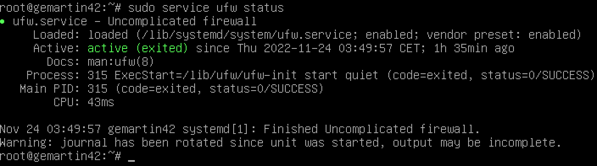

# EVALUATION

## Mandatory Part

### Project Overview

- ¿Cómo funciona una máquina virtual?

  Es un software que emula el funcionamiento de un sistema informático dentro del sistema, ejecutando un ""equipo virtual" dentro del equipo físico y permite instalar y ejecutal un Sistema Operativo.

  Esto a través de un HIPERVISOR, software que actúa como intermediario entre Host (equipo físico) y la Máquina Virtual(equipo virtual). El Hipervisor administra los recursos físicos.
  Existen dos tipos de HIPERVISOR: - Tipo 1: corre directamente sobre el hardware del host (sin S.O.), aumentando su eficiencia. - Tipo 2: corre sobre un S. O., siendo más accesible pero menos eficiente (VIRTUAL BOX).

  La asignación de recursos físicos disponibles para la máquina virtual lo determina el Hipervisor (CPU y Memoria). El almacenamiento de la máquina virtual es un archivo en el disco del Host, y lo considera su "disco duro".

  Las máquinas virtuals son aisladas, ya que sus errores y configuraciones no afectan al host ni a otras máquinas virtuales. Además, las máquinas virtuales son portatiles, ya que se puede instalar y ejecutar en otros equipos. Cabe resaltar que las utilidades más imprtantes de las máquinas virtuales son: - Pruebas de software. - Seguridad. - Desarrollo de Sistemas Operativos.

- ¿Por qué Debian? Diferencias con Rocky.

  Entre las dos opsciones (Debian y Rocky), la configuración de Debian es más sencilla. Además, Rocky está diseñada para el entorno empresarial haciéndolo más eficiente para ese entorno.
  Debian tiene más estabilidad¿qué ; su soporte es brindado por la comunidad, haciéndolo aumentar su durabilidad (al menos las versiones "stable"). Debian también tiene una política de software libre.

- Propósito de la Máquina Virtual

  Crear un servidor.

- Diferencia entre ATP y APTITUDE (herramientas de gestión de paquetes)

  · Interfaz: ATP es una colección de comandos. Aptitude también, pero con una intefaz gráfica, haciéndola más interactiva.
  · Resolución de problemas de dependencia: ATP sólo informa los errores encontrados, Aptitude te ofrece una solución.
  · Manejo: ATP sólo cumple las tareas específicas. Aptitude, te da un manejo de opciones.
  · Entrono Debian: ATP está mucho más presente en configuraciones Debian que Aptitude.

  ATP es más directo, para usuarios que saben que hacer (con scripts). Aptitude es más completo e interactivo.

- APPArmor (Application Armor)

  Sistema de control de acceso obligatorio que proporciona seguridad a S.O. Linux. Restringe capacidades por protección ante vulnerabilidades y abusos de PRIVILEGIOS, a través de la creación de usuarios/perfiles con permisos.

  Existen dos modos de protección: - Modo Permisivo: Registra los intentos de violación de las reglas, no los bloquea. - Modo Confinamiento: Restringe activamente las operaciones no permitidas.

  APPArmor es útil para servidores y entornos donde es importante tener un control sobre los recursos y permisos de cada app.

## Evaluation's commands

- Revisar que no hay ninguna interfaz gráfica en uso:
  ls /usr/bin/\*session >>> /usr/bin/bdus-run-session

- Revisar que UFW está corriendo:
  sudo service ufw status >>> Active: active(exited)

- Revisar que SSH está corriendo:
  sudo service ufw status >>> Active: active(running)

- Revisar qué S.O. está en uso:
  uname -v >>> #1 SMP PREEMPT_DYNAMIC Debian 6.1.112-1 (2024-09-30)

- Revisar que el user está en SUDO y USER42
  getent group sudo
  getent group user42

- Crea un nuevo usuario y verificar que la contraseña cumpla la política.
  sudo adduser "new_user"

  POLITICAS:
  • Tu contraseña debe tener como mínimo 10 caracteres de longitud. Debe contener una mayúscula, una minúscula y un número. Por cierto, no puede tener más de 3 veces consecutivas el mismo carácter.
  • La contraseña no puede contener el nombre del usuario.
  • La siguiente regla no se aplica a la contraseña para root: La contraseña debe tener al menos 7 caracteres que no sean parte de la antigua contraseña.

  Estas políticas se determinan en commom-password

  nano /etc/pam.d/common-password >>> accedemos al fichero de configuración

  minlen=10 >>> longitud mínima
  ucredit=-1 >>> mínimo una mayúscula (+1 sería máximo una)
  dcredit=-1 >>> mínimo un número.
  lcredit=-1 >>> mínimo una minúscula.
  maxrepeat=3 >>> no se puede repetir más de 3 veces un carácter consecutivo.
  reject_username >>> no puede tener el nombre del usuario.
  difok=7 >>> al menos 7 caracteres disitintos de la antigua contraseña.
  enforce_for_root >>> aplica la política para usuario "Root".

- Añadir usuario nuevo a un nuevo grupo "evaluating" y comprobarlo
  sudo addgroup evaluating >>> nuevo grupo.
  sudo adduser new_user evaluating >>> añadir usuario al grupo
  getent group evaluating >>> comprobar

- Reemplazar el hostname por otro
  sudo nano /etc/hostname >>> reemplazar "kegonzal42" por "student42"
  sudo nano /etc/hosts >>> reemplazar el login por "new_user"

  Reiniciar con "sudo reboot" y debería aparecer el nuevo hostname con "hostname"

- Comprobar las particiones:
  lsblk >>> muestra la partición del disco

- Comprobar sudo:
  which sudo
  dpkg -s sudo

  which : busca dónde está el ejecutable del comando seleccionado.
  dpkg : es un sistema de gestión de paquetes, permitiendo instalar, eliminar y consultar.
  · dpkg -s : muestra el "estado".

- Muestra reglas de sudo
  nano /etc/sudoers.d/sudo_config

  Defaults passwd_tries=3 >>> número de intentos
  Defaults badpass_message="Error: Pleas try again" >>> mensaje en caso de error
  Defaults logfile="/var/log/sudo/sudo_config" >>> lugar que almacena los intentos de sudo
  Defaults log_input, log_output >>> los comandos, tantos input y output, queden registrados
  Defaults iolog_dir="/var/log/sudo" >>> lugar donde quedarán registrados.
  Defaults requiretty >>> requiere uns sesión TTY para ejecutar sudo
  Defaults secure_path="/usr/local/sbin:/usr/local/bin:/usr/sbin:/usr/bin:/sbin:/bin:/snap/bin" >>> Restringe los directorios, estableciendo un entorno seguro de variables PATH.

- Verificar UFW
  sudo service ufw status >>> revisa la actividad.
  sudo ufw status >>> revisa la configuración

  UFW es una interfaz de configuración de firewall que usa comandos simples para configurar las iptables (programa que permite a un administrador de sistemas configurar el conjunto de reglas), estos permiten definir políticas de firewall para controlar el trafico de entrada y salida.

  

  · ufw.service - Uncomplicated firewall: Nombre del servicio
  · Loaded: Indica que el archivo de configuración está cargado desde /lib/systemd/system/ufw.service. También muestra que el servicio está habilitado, lo que significa que se inicia automáticamente en cada arranque del sistema.
  · Active: active (exited): Esto indica que el servicio UFW está activo, en estado "exited", lo cual significa que la configuración del firewall fue aplicada exitosamente, pero el proceso en sí no está en ejecución continua, ya que configura el firewall y luego finaliza.
  · Process: 315 ExecStart=/lib/ufw/ufw-init start quiet (code=exited, status=0/SUCCESS): Informa que el proceso para iniciar UFW se ejecutó con éxito.
  · Main PID: 315: Es el ID del proceso principal que ejecutó la configuración de UFW.
  · CPU: 43ms: Tiempo de CPU para ejecutar UFW.

- Añadir puerto UFW
  sudo ufw allow 8080 >>> crea el puerto
  sudo ufw status numbered >>> verifica
  sudo ufw delete #regla >>> borra la regla

- Revisar el servicio SSH
  sudo service ssh status >>> Active: active(running)

  SSH Es un protocolo de red que permite contectarse de forma segura a otro sistema a través de una red, por su comunicación encriptada (tanto usuario como la data).

  SSH permite iniciar sesión desde el terminal. También usa llaves públicas y privadas para la autenticación segura (no contraseñas).
